# Elysium Tours — Backend Architecture Mermaid Diagrams
> Pass each code block individually to DeepSeek for diagram generation

---

## 1. High-Level System Architecture

```mermaid
graph TB
    subgraph "Client Layer"
        WEB["🌐 Customer Website<br/>(React 19 + Vite)"]
        ADMIN["🔧 Admin Dashboard<br/>(React Admin Panel)"]
        MOBILE["📱 Mobile App<br/>(Future Phase)"]
    end

    subgraph "API Gateway Layer"
        GW["Moleculer API Gateway<br/>Rate Limiting | CORS | Auth Middleware"]
    end

    subgraph "Microservices Layer"
        subgraph "Core Services"
            AUTH["Auth Service<br/>JWT + OAuth"]
            USER["User Service<br/>Profiles & Entities"]
            RBAC["RBAC Service<br/>Roles & Permissions"]
        end

        subgraph "Tour Domain Services"
            TOUR_PKG["Tour Package Service<br/>Pre-packaged Tours"]
            TOUR_DYN["Dynamic Tour Service<br/>Build-Your-Own"]
            PRICING["Pricing Desk Service<br/>Manual Quote Management"]
            BOOKING["Booking Service<br/>Reservations & Status"]
            PAYMENT["Payment Service<br/>Transactions & Invoicing"]
        end

        subgraph "Partner Services"
            HOTEL["Hotel Partner Service<br/>Partner Hotels & Tiers"]
            TRANSPORT["Transport Service<br/>Vehicles & Routes"]
            ATTRACTION["Attraction Service<br/>Destinations & Activities"]
            DINING["Dining Service<br/>Restaurant Partners"]
        end

        subgraph "Communication Services"
            EMAIL["Email Service<br/>Transactional + Marketing"]
            NOTIF["Notification Service<br/>Push, Email, SMS"]
            TEMPLATE["Template Service<br/>Email & Message Templates"]
        end

        subgraph "Platform Services"
            MEDIA["Media Service<br/>Cloudinary Uploads"]
            SEARCH["Search Service<br/>Tours & Destinations"]
            ANALYTICS["Analytics Service<br/>Bookings & Revenue"]
            CMS["CMS Sync Service<br/>Sanity.io Content"]
        end
    end

    subgraph "Data Layer"
        MONGO[(MongoDB<br/>Primary Database)]
        REDIS[(Redis<br/>Cache & Queues)]
        SANITY[(Sanity CMS<br/>Content Management)]
        CLOUD[(Cloudinary<br/>Media Storage)]
    end

    WEB --> GW
    ADMIN --> GW
    MOBILE --> GW
    GW --> AUTH
    GW --> USER
    GW --> RBAC
    GW --> TOUR_PKG
    GW --> TOUR_DYN
    GW --> PRICING
    GW --> BOOKING
    GW --> PAYMENT
    GW --> HOTEL
    GW --> TRANSPORT
    GW --> ATTRACTION
    GW --> DINING
    GW --> MEDIA
    GW --> SEARCH
    GW --> ANALYTICS
    GW --> CMS

    AUTH --> MONGO
    USER --> MONGO
    RBAC --> MONGO
    TOUR_PKG --> MONGO
    TOUR_DYN --> MONGO
    PRICING --> MONGO
    BOOKING --> MONGO
    PAYMENT --> MONGO
    HOTEL --> MONGO
    TRANSPORT --> MONGO
    ATTRACTION --> MONGO
    DINING --> MONGO
    ANALYTICS --> MONGO

    NOTIF --> REDIS
    EMAIL --> REDIS
    SEARCH --> REDIS
    CMS --> SANITY
    MEDIA --> CLOUD

    PRICING --> EMAIL
    PRICING --> NOTIF
    BOOKING --> EMAIL
    BOOKING --> NOTIF
    PAYMENT --> EMAIL
```

---

## 2. Microservice Architecture (Detailed Service Map)

```mermaid
graph LR
    subgraph "API Gateway"
        API["api.service.js<br/>───────────<br/>/api/auth/*<br/>/api/users/*<br/>/api/tours/*<br/>/api/bookings/*<br/>/api/partners/*<br/>/api/admin/*<br/>/api/media/*<br/>/api/search/*<br/>/api/notifications/*"]
    end

    subgraph "Auth & Identity"
        A1["auth.service<br/>───────────<br/>register<br/>login<br/>verifyOTP<br/>refreshToken<br/>googleOAuth<br/>forgotPassword"]
        A2["user.service<br/>───────────<br/>getProfile<br/>updateProfile<br/>uploadAvatar<br/>switchEntity<br/>listUsers (admin)"]
        A3["rbac.service<br/>───────────<br/>createRole<br/>assignPermission<br/>checkAccess<br/>entityManagement"]
    end

    subgraph "Tour Management"
        T1["tourPackage.service<br/>───────────<br/>listPackages<br/>getPackage<br/>createPackage (admin)<br/>updatePackage (admin)<br/>toggleActive (admin)<br/>getPricing"]
        T2["dynamicTour.service<br/>───────────<br/>getDestinations<br/>getOptions<br/>buildTourRequest<br/>submitForPricing<br/>getMyRequests<br/>cancelRequest"]
        T3["pricingDesk.service<br/>───────────<br/>getQueue (admin)<br/>assignQuote (admin)<br/>submitQuote (admin)<br/>sendToCustomer<br/>customerAccept<br/>customerReject<br/>getSLAMetrics"]
    end

    subgraph "Booking & Payment"
        B1["booking.service<br/>───────────<br/>createBooking<br/>getBooking<br/>listBookings<br/>updateStatus (admin)<br/>cancelBooking<br/>generateInvoice"]
        B2["payment.service<br/>───────────<br/>initiatePayment<br/>verifyPayment<br/>refundPayment<br/>getTransactions<br/>reconcile (admin)"]
    end

    subgraph "Partner Management"
        P1["hotelPartner.service<br/>───────────<br/>listHotels<br/>getHotel<br/>registerPartner (admin)<br/>updatePartner (admin)<br/>setCommission (admin)<br/>getByDestination"]
        P2["transport.service<br/>───────────<br/>listVehicles<br/>getCapacityOptions<br/>registerProvider (admin)<br/>updateRoutes (admin)<br/>estimateBase"]
        P3["attraction.service<br/>───────────<br/>listAttractions<br/>getByDestination<br/>createAttraction (admin)<br/>updateAttraction (admin)<br/>setAvailability"]
        P4["dining.service<br/>───────────<br/>listRestaurants<br/>getByDestination<br/>registerPartner (admin)<br/>updatePartner (admin)<br/>setMenuOptions"]
    end

    subgraph "Communication"
        C1["email.service"]
        C2["notification.service"]
        C3["template.service"]
        C4["sms.service"]
    end

    subgraph "Platform"
        PL1["media.service"]
        PL2["search.service"]
        PL3["analytics.service"]
        PL4["cms.service"]
    end

    API --> A1
    API --> A2
    API --> A3
    API --> T1
    API --> T2
    API --> T3
    API --> B1
    API --> B2
    API --> P1
    API --> P2
    API --> P3
    API --> P4
    API --> C1
    API --> C2
    API --> PL1
    API --> PL2
    API --> PL3
    API --> PL4
```

---

## 3. Pre-Packaged Tour Flow (Customer Journey)

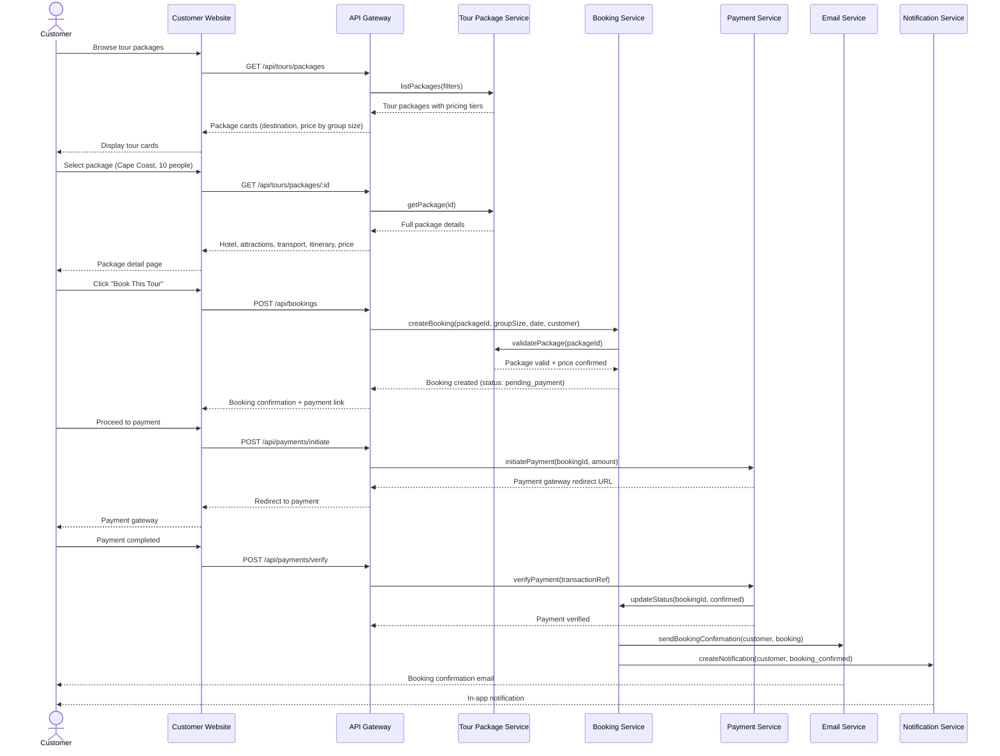

---

## 4. Dynamic Tour (Build-Your-Own) Flow

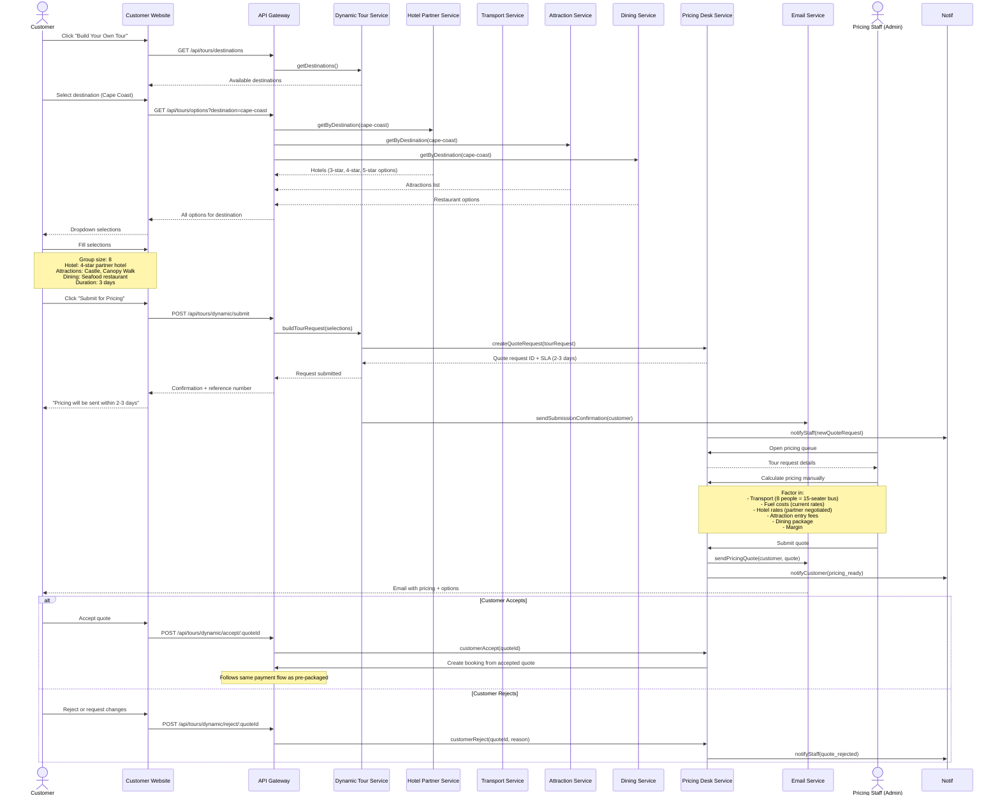

---

## 5. Admin Dashboard Architecture

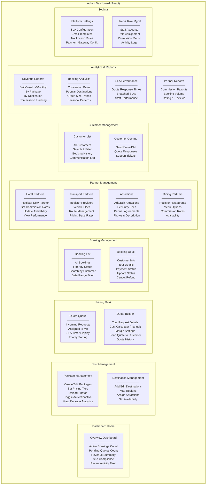

---

## 6. Data Model (Entity Relationship)

```mermaid
erDiagram
    USER ||--o{ BOOKING : makes
    USER ||--o{ TOUR_REQUEST : submits
    USER {
        ObjectId _id
        string email
        string password
        string firstName
        string lastName
        string phone
        string avatar
        string role
        boolean isVerified
        string status
        Date lastLogin
    }

    TOUR_PACKAGE ||--o{ BOOKING : booked_as
    TOUR_PACKAGE ||--o{ PACKAGE_PRICING : has_legacy_tiers
    TOUR_PACKAGE ||--o{ ACCOMMODATION_OPTION : offers
    TOUR_PACKAGE }|--|| DESTINATION : at
    TOUR_PACKAGE }o--o{ ATTRACTION : includes
    TOUR_PACKAGE }o--|| HOTEL_PARTNER : stays_at
    TOUR_PACKAGE {
        ObjectId _id
        string title
        string description
        string slug
        ObjectId destinationId
        ObjectId hotelPartnerId
        array attractionIds
        array diningIds
        string transportType
        array images
        string displayCurrency
        boolean isActive
        string status
    }

    PACKAGE_PRICING {
        ObjectId _id
        ObjectId packageId
        int minGroupSize
        int maxGroupSize
        number pricePerPerson
        number totalPrice
        string currency
    }

    ACCOMMODATION_OPTION }o--|| HOTEL_PARTNER : primary
    ACCOMMODATION_OPTION ||--o{ ACCOMMODATION_PRICING_ROW : prices
    ACCOMMODATION_OPTION ||--o{ DESTINATION_HOTEL_MAP : per_city
    ACCOMMODATION_OPTION {
        ObjectId _id
        string label
        string tier
        ObjectId hotelPartnerId
        string description
        boolean isActive
    }

    ACCOMMODATION_PRICING_ROW {
        string roomType
        int minGroupSize
        int maxGroupSize
        number pricePerPerson
    }

    DESTINATION_HOTEL_MAP }o--|| DESTINATION : for
    DESTINATION_HOTEL_MAP }o--|| HOTEL_PARTNER : maps_to
    DESTINATION_HOTEL_MAP {
        ObjectId destinationId
        ObjectId hotelPartnerId
        int nights
    }

    DESTINATION ||--o{ TOUR_PACKAGE : offers
    DESTINATION ||--o{ ATTRACTION : has
    DESTINATION ||--o{ HOTEL_PARTNER : located_in
    DESTINATION ||--o{ DINING_PARTNER : located_in
    DESTINATION {
        ObjectId _id
        string name
        string region
        string description
        object gpsCoords
        array images
        boolean isActive
    }

    TOUR_REQUEST ||--|| QUOTE : receives
    TOUR_REQUEST }|--|| DESTINATION : going_to
    TOUR_REQUEST {
        ObjectId _id
        ObjectId customerId
        ObjectId destinationId
        int groupSize
        string hotelPreference
        array selectedAttractions
        array diningPreferences
        string transportPreference
        Date preferredDate
        int durationDays
        string specialRequests
        string status
        Date submittedAt
    }

    QUOTE ||--o| BOOKING : converts_to
    QUOTE {
        ObjectId _id
        ObjectId tourRequestId
        ObjectId assignedStaffId
        number totalPrice
        number pricePerPerson
        object costBreakdown
        string currency
        string status
        Date sentAt
        Date respondedAt
        Date slaDeadline
        string customerResponse
    }

    BOOKING ||--|| PAYMENT : paid_via
    BOOKING {
        ObjectId _id
        ObjectId customerId
        ObjectId packageId
        ObjectId quoteId
        string bookingType
        string bookingRef
        int groupSize
        Date tourDate
        Date endDate
        number totalAmount
        string currency
        string displayCurrency
        ObjectId accommodationOptionId
        string accommodationLabel
        string accommodationTier
        string roomType
        number pricePerPerson
        string status
        Date createdAt
    }

    PAYMENT }o--o| FOREX_RATE : locked_at
    PAYMENT {
        ObjectId _id
        ObjectId bookingId
        ObjectId customerId
        number amount
        string currency
        string displayCurrency
        number amountInDisplayCurrency
        string settlementCurrency
        number amountGHS
        number fxRate
        Date fxLockedAt
        ObjectId fxRateRef
        string provider
        string transactionRef
        string status
        Date paidAt
        object metadata
    }

    FOREX_RATE {
        ObjectId _id
        string fromCurrency
        string toCurrency
        number rate
        number markupPercent
        Date effectiveDate
        Date expiresAt
        string source
        boolean isActive
    }

    HOTEL_PARTNER }|--|| DESTINATION : in
    HOTEL_PARTNER {
        ObjectId _id
        string name
        ObjectId destinationId
        string tier
        number commissionRate
        object contactInfo
        boolean isActive
        array amenities
        array images
    }

    TRANSPORT_PROVIDER ||--o{ VEHICLE : owns
    TRANSPORT_PROVIDER {
        ObjectId _id
        string companyName
        string contactPerson
        string phone
        boolean isActive
        number commissionRate
    }

    VEHICLE {
        ObjectId _id
        ObjectId providerId
        string type
        int capacity
        number basePricePerDay
        boolean isAvailable
    }

    ATTRACTION }|--|| DESTINATION : located_in
    ATTRACTION {
        ObjectId _id
        string name
        ObjectId destinationId
        string category
        number entryFee
        string description
        array images
        boolean isActive
    }

    DINING_PARTNER }|--|| DESTINATION : in
    DINING_PARTNER {
        ObjectId _id
        string name
        ObjectId destinationId
        string cuisineType
        string tier
        number commissionRate
        boolean isActive
    }
```

---

## 7. Middleware & Auth Flow

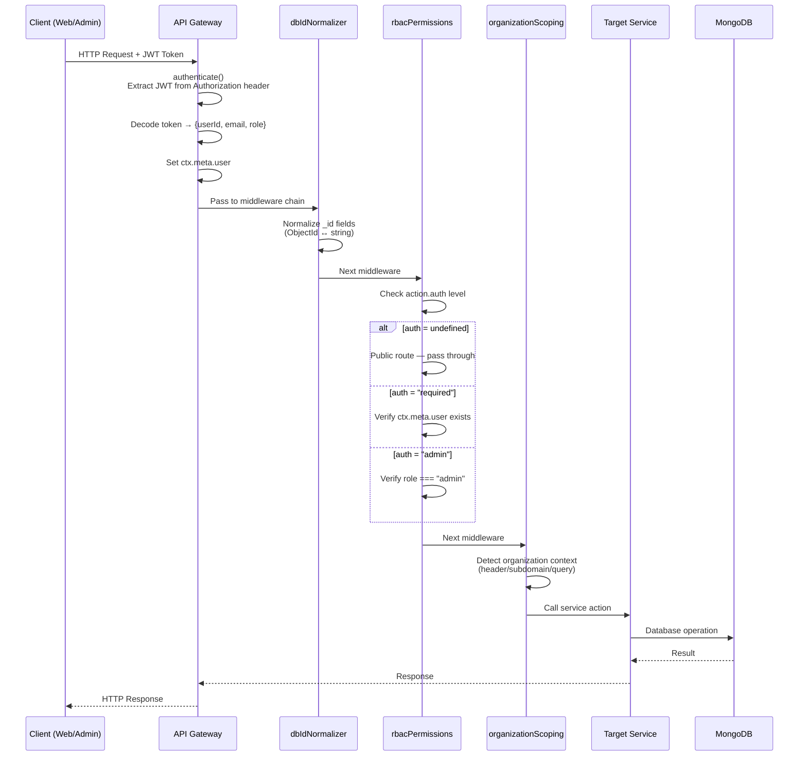

---

## 8. Deployment Architecture

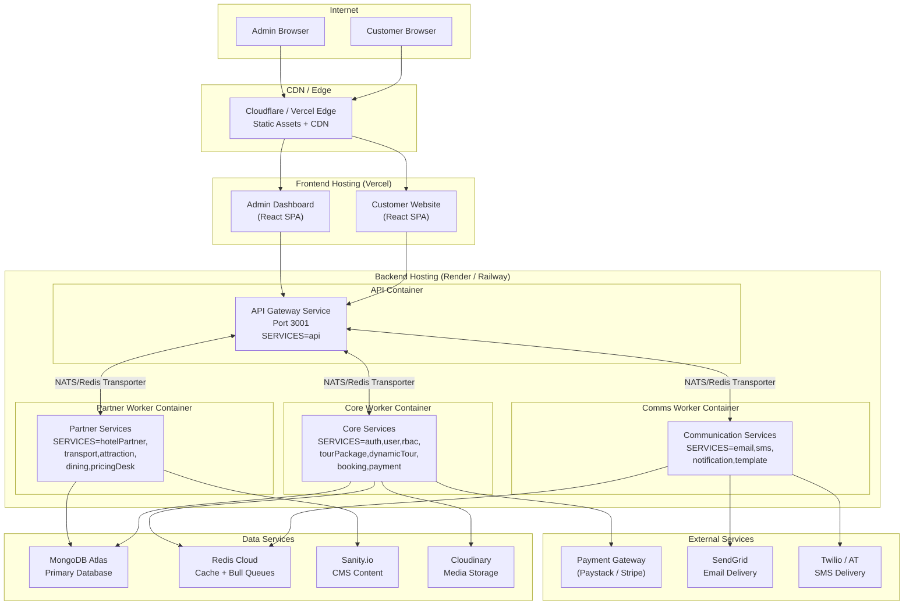

---

## 9. Tour Lifecycle State Machine

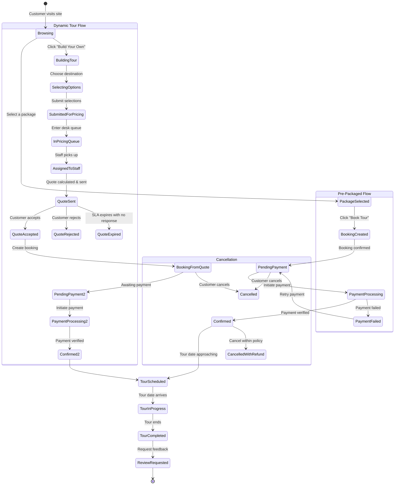

---

## 10. Admin Pricing Desk Workflow

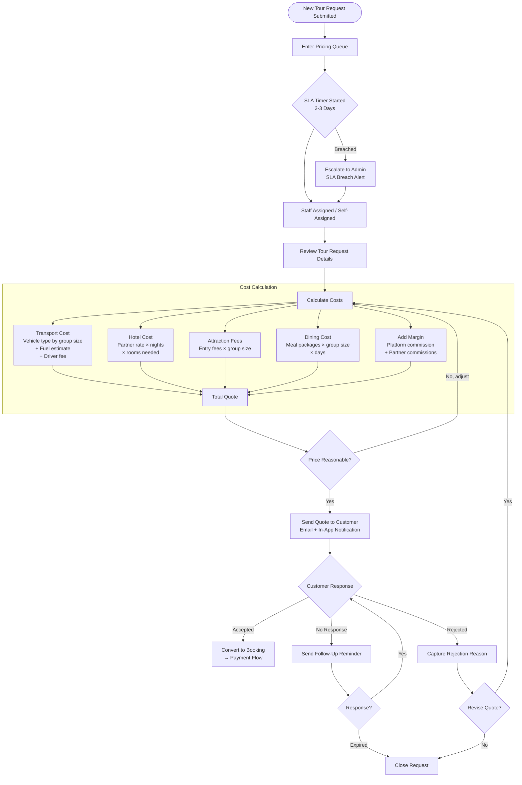

---

## 11. Complete Page Map (Customer + Admin)

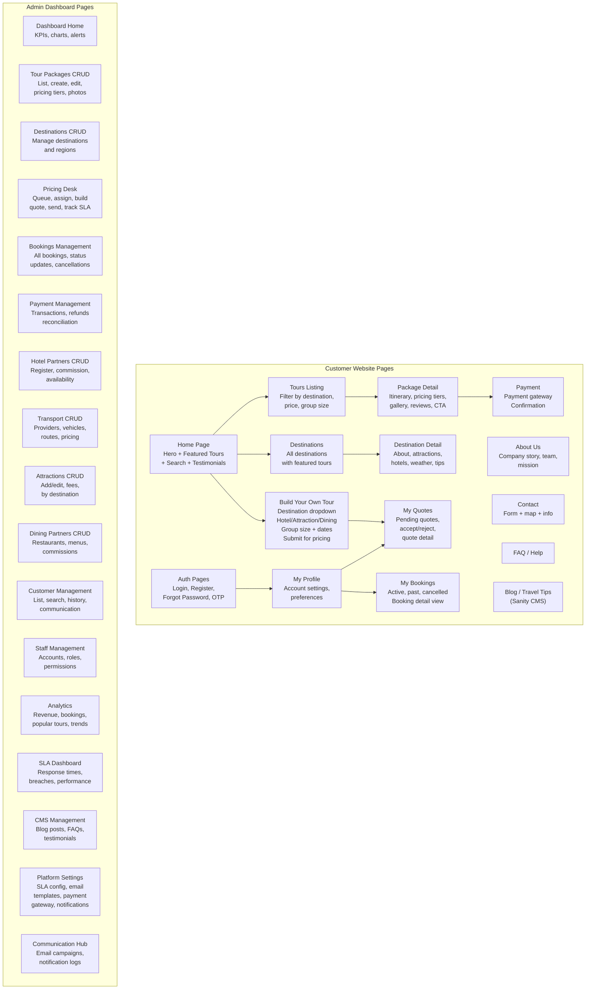
